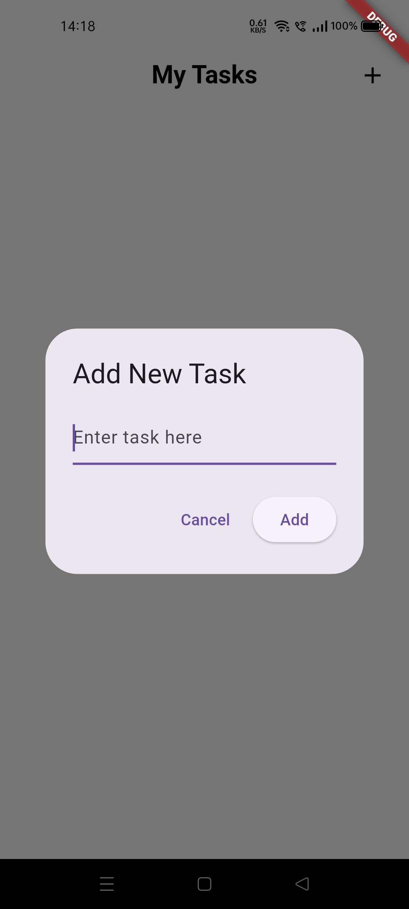

# Overview

A simple To-Do list application built with Flutter using the BLoC pattern for state management. This app allows users to add, view, and delete tasks, with data persistence using `shared_preferences`.

## Features
- Add new tasks via a dialog triggered by the "+" button.
- View a list of tasks with a clean, minimal UI.
- Delete tasks using the trash icon.
- Persist tasks locally using `shared_preferences`.

## Screenshots

### Empty Screen


### Add Task Dialog


### Task Screen


## Getting Started

### Prerequisites
- [Flutter](https://flutter.dev/docs/get-started/install) (ensure Flutter is installed and set up)
- A code editor (e.g., VS Code, Android Studio)

### Installation
1. Clone the repository:
   ```
   git clone https://github.com/<your-username>/<repository-name>.git
   ```
2. Navigate to the project directory:
   ```
   cd <repository-name>
   ```
3. Install dependencies:
   ```
   flutter pub get
   ```
4. Run the app:
   ```
   flutter run
   ```

## Dependencies
- `flutter_bloc`: For state management.
- `shared_preferences`: For local data persistence.
- `equatable`: For comparing state objects.

Check `pubspec.yaml` for the full list of dependencies.

## Project Structure
- `lib/main.dart`: Entry point and main UI.
- `lib/blocs/`: Contains BLoC logic (`todo_bloc.dart`, `todo_event.dart`, `todo_state.dart`).

## Contributing
Feel free to fork this repository and submit pull requests for any improvements.

## License
This project is licensed under the MIT License.
